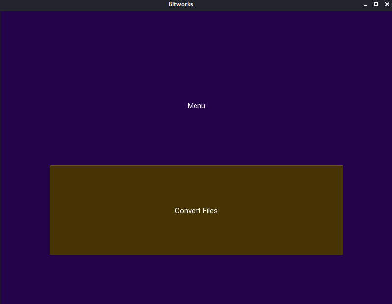
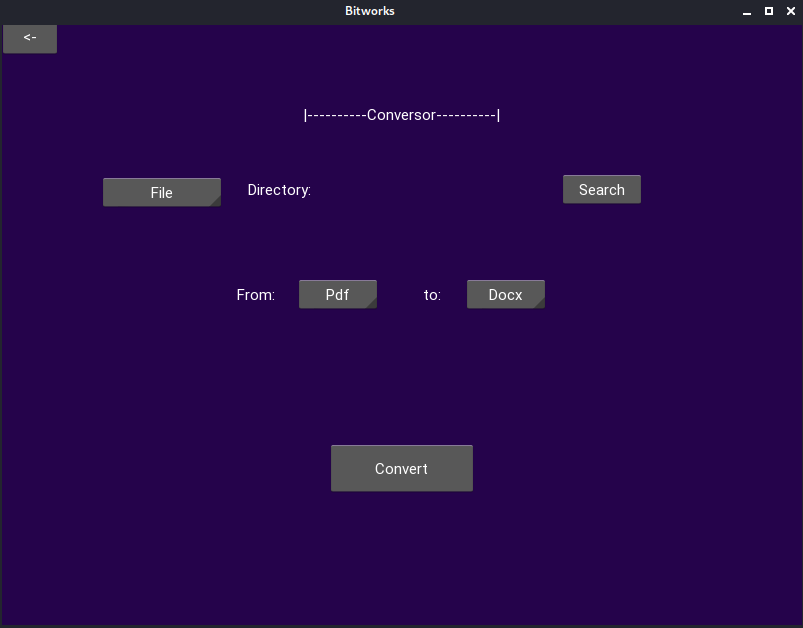

# File-converter

converter pdf, docx, png, jpg, csv, json and html files

---

---

# About this Project

Program with a graphical interface made in kivy, you select if you want to convert just one file or all files in a folder with subdirectories or
no, then select the respective directory where the files are and finally which and to what format you want to convert.

# Why

i saw somme one on uptowork asking for a file conversor that can convert all files in a folder, actualy exists a lot of online conversors but to convert you need to put just some files, so, if you have a big amount of files to convert that will take a lot of time, so i decided to develop it. This project is part of my personal portifolio, so, i will be happy if you want to conttribute with some project structure or anything you can report that can make me a better developer!

Also, you can use this project for anything.
